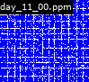

# Advent of Code 2020

Day 11 Part II Visualization:

Day 12 Part II Visualization:
- White is the boat
- Red is the waypoint direction the boat should follow

# Timings:
- MacBook Pro (Retina, 13-inch, Early 2015)
- 3.1 GHz Dual-Core Intel Core i7
- 16 GB 1867 MHz DDR3
01. [day_03.run]: Completed in 2.8 ms
02. [day_04.run]: Completed in 7.3 ms
03. [day_05.run]: Completed in 7.0 ms
04. [day_06.run]: Completed in 8.0 ms
05. [day_09.run]: Completed in 7.1 ms
06. [day_10.run]: Completed in 1.8 ms
07. [day_07.run]: Completed in 75.0 ms
08. [day_13.run]: Completed in 78.6 ms
09. [day_01.run]: Completed in 151.8 ms
10. [day_08.run]: Completed in 59.0 ms
11. [day_02.run]: Completed in 11.5 ms
12. [day_14.run]: Completed in 2771.7 ms
13. [day_19.run]: Completed in 2643.2 ms
14. [day_20.run]: Completed in 17435.4 ms
15. [day_21.run]: Completed in 4.1 ms
16. [day_17.run]: Completed in 23285.2 ms
17. [day_18.run]: Completed in 61.0 ms
18. [day_22.run]: Completed in 6893.7 ms
19. [day_23_retcon.run]: Completed in 17655.1 ms
20. [day_25.run]: Completed in 17117.4 ms
21. [day_11.run]: Completed in 48866.2 ms
22. [day_12.run]: Completed in 7.3 ms
23. [day_15.run]: Completed in 75384.7 ms
24. [day_16.run]: Completed in 4917.6 ms
25. [day_24.run]: Completed in 783643.3 ms